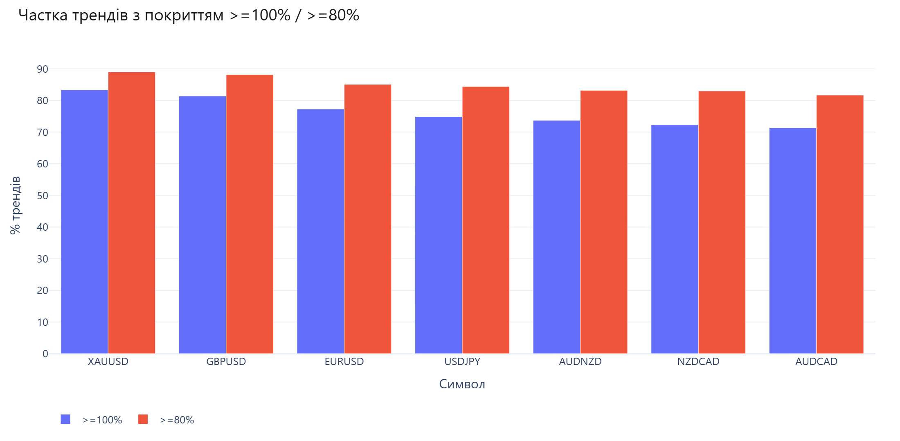

# Аналіз трендів і корекцій (ZigZag)

## Мета

Систематично виміряти, **наскільки глибоко ціна повертається після сильних трендів** (перша ZigZag-корекція та макс. корекція у заданому вікні), і порівняти це між валютними парами та металами на однакових правилах. Результат — дані й звіти для оцінки типичної глибини відкату, а не торгові сигнали.

Звіти (HTML/PDF/CSV) зберігаються в папці [`results/`](results/).

Локальний пайплайн: `сирий M1 → clean → вищий TF → ZigZag-тренди/корекції → HTML/PDF → порівняння символів`.


Приклад зі звіту compare (`compare_{tf}_correction_coverage`):



*Частка трендів з покриттям >=100% / >=80%*

Шляхи до `data/` і `results/` беруться від кореня проєкту (`libs/cli_args.py`), тож cwd не важливий.
Запускати скрипти зручно з кореня проєкту (щоб `import libs` і відносні команди з README працювали як є).

## Спільні параметри

Більшість кроків приймають **символ** і **таймфрейм** однаково:

```bash
python <script>.py EURUSD
python <script>.py EURUSD h1
python <script>.py --symbol AUDCAD
python <script>.py --symbol AUDCAD m15
python <script>.py EURUSD --tf h4
```

| Параметр | Опис |
|---|---|
| символ | перший позиційний **або** `--symbol` (обов’язково один; якщо обидва — перемагає `--symbol`) |
| TF | другий позиційний, або єдиний позиційний після `--symbol`, або `--tf` (за замовчуванням `h1`; `--tf` перемагає) |

Підтримувані TF: `m5`, `m15`, `m30`, `h1`, `h4`, `d1`, `w1`.  
Аліаси: `5m`/`15m`/`30m`, `1h`/`60m`, `4h`/`240m`, `1d`/`d`, `1w`/`w`.

`clean_data.py` приймає лише символ (позиційний або `--symbol`).  
`compare_symbols.py` приймає лише TF (і опційно `--symbols`); символ не обов’язковий.

Спільна логіка CLI: `libs/cli_args.py`.

## Вимоги

```bash
pip install -r requirements.txt
```

| Скрипт | Залежності |
|---|---|
| `clean_data.py` | stdlib only |
| `convert_m1.py` | pandas |
| `analyze_trends_corrections.py` | pandas, numpy |
| `export_presentation.py` | pandas, plotly, kaleido, matplotlib |
| `compare_symbols.py` | pandas, plotly, kaleido, matplotlib |
| `run_pipeline.py` | (викликає скрипти вище; читає `config.yml`) |
| `verify_data.py` | pandas |
| `histogram_payload.py` | pandas |
| `libs/config.py` | PyYAML |

## Дані

Формат OHLC CSV (без заголовка): `date,time,open,high,low,close`  
Приклад рядка: `2003.05.05,03:00,1.12161,1.12209,1.12161,1.12209`

Сирий експорт MT5 часто має додаткові колонки в кінці (`tick_volume`, `volume`, `spread`) — їх прибирає `clean_data.py`.

| Файл | Опис |
|---|---|
| `data/{SYMBOL}_m1.csv` | хвилинні бари (після clean — 6 колонок) |
| `data/{SYMBOL}_{tf}.csv` | агрегований TF |
| `data/{SYMBOL}_{tf}_trends_corrections.csv` | результат ZigZag-аналізу |

## Конфіг (`config.yml`)

Параметри пайплайну за замовчуванням і **per-symbol** overrides (наприклад `XAUUSD.threshold: 2000`).

| Секція | Зміст |
|---|---|
| `defaults` | `tf`, `days`, `threshold`, `top`, `pdf`, `skip_clean`, `skip_convert`, `compare` |
| `symbols` | список інструментів і їх overrides (`threshold`, `days`, `top`, `tf`, `pip_size`, …) |
| `paths` | каталоги `data` / `results` (відносно кореня проєкту) |
| `compare` | `pdf`; опційно обмеження списку символів |

Явний CLI завжди перебиває config. Завантаження: `libs/config.py`.  
`run_pipeline.py` передає `--config` у **всі** дочірні кроки, тож кастомні `paths` працюють у clean/convert/analyze/export/compare.

`defaults.compare: true` оновлює compare після кожного `run_pipeline` (одного символа або `--all`); вимкнути: `--no-compare`.

У compare при **різних** `zigzag_threshold_pips` / `correction_days` виводиться WARNING (FX 100 vs XAU 2000 — навмисно).

**Дані:** каталоги `data/` і `results/` можуть займати гігабайти — не коміть їх у git без потреби.

```bash
python run_pipeline.py --all
python run_pipeline.py XAUUSD              # threshold з config (2000)
python run_pipeline.py XAUUSD --threshold 1000   # CLI перемагає
python run_pipeline.py --all --no-pdf --no-compare
python run_pipeline.py --config path/to/config.yml --all
```

Pip: `libs.cli_args.pip_size(symbol)` — `0.0001` за замовчуванням; `0.01` для JPY-квадруваних пар і металів (`XAU*`, `XAG*`). Можна задати `symbols.XAUUSD.pip_size` у config.

---

## 1. Очищення сирого M1

| | |
|---|---|
| Вхід / вихід | `data/{SYMBOL}_m1.csv` (in-place) |

Залишає лише перші 6 колонок: `date,time,open,high,low,close`.

```bash
python clean_data.py EURUSD
python clean_data.py --symbol AUDCAD
```

---

## 2. Конвертація M1 → потрібний TF

| | |
|---|---|
| Вхід | `data/{SYMBOL}_m1.csv` |
| Вихід | `data/{SYMBOL}_{tf}.csv` |

```bash
python convert_m1.py EURUSD
python convert_m1.py EURUSD h1
python convert_m1.py --symbol AUDCAD m15
```

Агрегація: open першої хвилини, high/low max/min, close останньої; порожні інтервали відкидаються. Тиждень — `1W-MON`.

---

## 3. Аналіз трендів і корекцій

| | |
|---|---|
| Вхід | `data/{SYMBOL}_{tf}.csv` |
| Вихід | `data/{SYMBOL}_{tf}_trends_corrections.csv` (сортування за `trend_pips` ↓) |

```bash
python analyze_trends_corrections.py EURUSD
python analyze_trends_corrections.py EURUSD h1 --days 30 --threshold 100
python analyze_trends_corrections.py --symbol AUDCAD --tf h1
```

| Параметр | За замовчуванням | Опис |
|---|---|---|
| `--threshold` | з `config.yml` (зазвичай `100`) | мінімальний ZigZag-свінг у pips |
| `--days` | з `config.yml` (зазвичай `30`) | календарне вікно для **макс. корекції** після кінця тренду |
| `--config` | `config.yml` | шляхи `data`/`results` і per-symbol defaults |

### Методика

Для кожного підтвердженого ZigZag-леґу **A→B** (тренд):

1. **Перша корекція** — наступний леґ **B→C** (перший протилежний свінг).  
   Дати: `correction_start` (= `trend_end`), `correction_end`.
2. **Макс. корекція (Max correction)** — найглибше повернення ціни **в бік початку тренду A** протягом `--days` днів після B (бари строго після кінця тренду):
   - uptrend → найнижчий `low` у вікні;
   - downtrend → найвищий `high` у вікні.  
   Дати: `max_correction_start` (= `trend_end`), `max_correction_end`.  
   `gap_to_start_pips` — відстань від екстремуму корекції до ціни A.

Останній леґ без C має порожню першу корекцію (`NaN` / порожні дати).

### Колонки CSV

| Колонка | Зміст |
|---|---|
| `trend_rank` | місце за розміром тренду (1 = найбільший) |
| `direction` | `up` / `down` |
| `trend_pips`, `trend_start`, `trend_end` | розмір і дати тренду |
| `trend_start_price`, `trend_end_price`, `trend_bars` | ціни A/B і кількість барів |
| `correction_*` | перша ZigZag-корекція (pips, % від тренду, дати, ціна кінця, бари) |
| `correction_days` | вікно `--days`, використане при розрахунку |
| `zigzag_threshold_pips` | поріг ZigZag (`--threshold`) |
| `max_correction_*` | макс. корекція (pips, %, дати, ціна, бари) |
| `gap_to_start_pips` | скільки pips лишилось до початку тренду на екстремумі |

---

## 4. Презентація результатів

| | |
|---|---|
| Вхід | `data/{SYMBOL}_{tf}_trends_corrections.csv` |
| Вихід | `results/{SYMBOL}_{tf}_trends_corrections.html` |
| | `results/{SYMBOL}_{tf}_trends_corrections.pdf` (опційно) |
| | `results/{SYMBOL}_{tf}_trends_corrections.csv` (копія) |

```bash
python export_presentation.py EURUSD
python export_presentation.py EURUSD h1 --top 100 --pdf
python export_presentation.py --symbol AUDCAD --no-pdf
```

| Параметр | За замовчуванням | Опис |
|---|---|---|
| `--top` | `100` | скільки найбільших трендів на останньому графіку |
| `--pdf` / `--no-pdf` | PDF увімкнено | писати PDF через kaleido + matplotlib |

HTML (Plotly, укр. UI): статистика, гістограми, топ-N, кнопка **Зберегти PDF**.  
Підзаголовок бере `zigzag_threshold_pips` і `correction_days` з CSV аналізу.

---

## 5. JSON-пейлоад для гістограм (опційно)

| | |
|---|---|
| Вхід | `data/{SYMBOL}_{tf}_trends_corrections.csv` |
| Вихід | stdout або файл (`-o`) |

```bash
python histogram_payload.py EURUSD --top 100
python histogram_payload.py --symbol AUDCAD h1 -o payload.json
```

---

## 6. Порівняння всіх символів

Останній крок пайплайну: збирає всі наявні `*_trends_corrections.csv` для TF і будує рейтинг перекриття корекцією.

| | |
|---|---|
| Вхід | `data/{SYMBOL}_{tf}_trends_corrections.csv` (усі символи з даними) |
| Вихід | `results/compare_{tf}_correction_coverage.html` |
| | `results/compare_{tf}_correction_coverage.pdf` (опційно) |
| | `results/compare_{tf}_correction_coverage.csv` |

```bash
python compare_symbols.py
python compare_symbols.py h1
python compare_symbols.py --tf h1 --pdf
python compare_symbols.py --tf h1 --symbols EURUSD GBPUSD AUDCAD
python compare_symbols.py --no-pdf
```

Сортування за медіаною `max_correction_pct`. У звіті: таблиця, графи перекриття ≥100%/≥80%, перша корекція %, розмір тренду, кількість трендів.
Якщо в когорті різні ZigZag-пороги або `correction_days` — у консоль і HTML іде WARNING.

---

## Швидкий повний цикл

Усі символи з `config.yml`:

```bash
python run_pipeline.py --all
```

Один символ (параметри з config, CLI за потреби):

```bash
python run_pipeline.py EURUSD
python run_pipeline.py EURUSD h1 --no-pdf
python run_pipeline.py XAUUSD              # threshold=2000 з config
```

Або кроками:

```bash
python clean_data.py EURUSD
python convert_m1.py EURUSD h1
python analyze_trends_corrections.py EURUSD h1 --days 30 --threshold 100
python export_presentation.py EURUSD h1 --top 100 --pdf
python compare_symbols.py h1 --pdf
```

Перевірка цілісності даних/звітів:

```bash
python verify_data.py h1
python verify_data.py --config config.yml --tf h1
```

Або з іменованими параметрами:

```bash
python run_pipeline.py --symbol AUDCAD --tf h1 --compare
```

## Contribution
Feel free to create an issue or a pull request if any ideas.

## Disclaimer
The source code of this repository is provided AS-IS and WITH NO WARRANTY of any kind.
Author and/or contributor are NOT responsible for any type of losses as a result of using source code, 
compiled binaries or other outcomes related to this repository.
